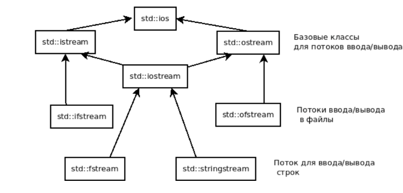

## Ввод - вывод с C++

### Иерархия классов



Глобальные переменные `cin` (от `istream`), `cout` (`ostream`), `cerr` (`ostream`)

Стандартная библиотека содержит перегруженные операторы `operator >>`, `operator <<` для примитивных типов и строк:

```c++

std::ostream& operator<<(std::ostream& os, int v) {
// convert int to bytes, write bytes
return os;
}

std::istream& operator>>(std::istream& is, int& v) {
// read bytes, convert to int
return is;
}
```

Следующий код приводит к очистке буфера потока, что замедляет вывод:

```c++
std::cout << x << std::endl;
```

Оператор читает строку до пробела, `getline` до конца строки:

```c++
std::ifstream ifstream in_file("in.txt");
std::string word;
in_file >> word;
std::string line;
getline(in_file, line);
```

Побайтовый ввод / вывод осуществляются при помощи функций `read, write, seekg, tellg`

### Методы / флаги / манипуляторы

Мы можем управлять вводом / выводом в C++ при помощи методов, флагов и манипуляторов.

Все они выполняют одну и ту же задачу: задают определенный формат ввода / вывода информации в потоках.

Теперь рассмотрим способы применения объектов форматирования:

```c++
std::cout.fill('=') // Устанавливает символ-заполнитель (тут он - "=")
std::cout.width(12) // Задает ширину поля, где ширина поля - количество символов в кжадой строке (тут ширина поля равна 12)
std::cout.precision(5) // Задает количество знаков после десятичной точки (тут - 5)
```

Флаги форматирования позволяют включить или выключить один из параметров ввода / вывода. Чтобы установить флаг ввода /
вывода, необходимо вызвать функцию `setf()`, а чтобы отключить флаг - нужно вызвать `unsetf()`:

```c++
std::cout.setf(std::ios::/*name_flag*/) // Установка флага вывода, где name_flag - имя флага
std::cout.unsetf(std::ios::/*name_flag*/) // Снятие флага вывода соответственно
```

Если при вводе / выводе необходимо установить (снять) несколько флагов, то можно спокойно использовать операцию `или`:

```c++
std::cout.setf(std::ios::/*name_flag_1*/ | std::ios::/*name_flag_2*/ | std::ios::/*name_flag_3*/) 
std::cout.unsetf(std::ios::/*name_flag_1*/ | std::ios::/*name_flag_2*/ | std::ios::/*name_flag_3*/) 
```

Перечислим основные флаги форматирования:

|     Флаг     |                                                                                          Назначение                                                                                           |
|:------------:|:---------------------------------------------------------------------------------------------------------------------------------------------------------------------------------------------:|
| `boolalpha`  |                                                                   Вывод логических величин в текстовом виде (`true, false`)                                                                   |
|    `dec`     |                                                                  Вывод величин в десятичной системе счисления (по умолчанию)                                                                  |
|    `oct`     |                                         Вывод величин в восьмеричной системе счисления (сначала снимаем флаг `dec`, а затем устанавливаем флаг `oct`)                                         |                                             |
|    `hex`     |                                      Вывод величин в шестнадцатеричной системе счисления (сначала снимаем флаг `dec`, а затем устанавливаем флаг `hex`)                                       |                                             |
| `uppercase`  | В шестнадцатеричной системе счисления использовать буквы верхнего регистра. Т.е. вместо `ff` выводится `FF` для `255` в десятичной системе) (по умолчанию установлены буквы нижнего регистра) |
|  `showpos`   |                                                                            Вывод знака `+` для положительных чисел                                                                            |
| `scientific` |                                                                    Вывод чисел с плавающей точкой в экспоненциальной форме                                                                    |
|   `fixed`    |                                                              Вывод чисел с плавающей точкой в фиксированной форме (по умолчанию)                                                              |
|   `right`    |                  Выравнивание по правой границе (стоит по умолчанию). Сначала надо задать ширину поля (ширина поля должна быть заведомо большей, чем длина выводимой строки)                  |
|    `left`    |                                                                                 Выравнивание по левой границе                                                                                 |

Пример:
```c++
int a = 255;
std::cout.unsetf(std::ios::dec);
std::cout.setf(std::ios::hex);
std::cout << a;
```
Программа выведет `ff`

Еще один способ форматирования - форматирование с помощью манипуляторов.

Манипулятор - объект особого типа, который управляет потоками ввода / вывода, для форматирования передаваемой в потоки
информации.

|        Манипулятор        |                                                                                          Назначение                                                                                           |
|:-------------------------:|:---------------------------------------------------------------------------------------------------------------------------------------------------------------------------------------------:|
|          `endl`           |                                                                              Переход на новую строку при выводе                                                                               |
|        `boolalpha`        |                                                                   Вывод логических величин в текстовом виде (`true, false`)                                                                   |
|       `noboolalpha`       |                                                                       Вывод логических величин в числовом виде (`1, 0`)                                                                       |
|           `oct`           |                                                                        Вывод величин в восьмеричной системе счисления                                                                         |
|           `hex`           |                                                                      Вывод величин в шестнадцатеричной системе счисления                                                                      |
|        `uppercase`        | В шестнадцатеричной системе счисления использовать буквы верхнего регистра. Т.е. вместо `ff` выводится `FF` для `255` в десятичной системе) (по умолчанию установлены буквы нижнего регистра) |
|       `nouppercase`       |               В шестнадцатеричной системе счисления **НЕ** использовать буквы верхнего регистра. Т.е. вместо `FF` выводится `ff` для `255` в десятичной системе) (по умолчанию)               |
|         `showpos`         |                                                                            Вывод знака `+` для положительных чисел                                                                            |
|       `scientific`        |                                                                    Вывод чисел с плавающей точкой в экспоненциальной форме                                                                    |
|    `setw(int number)`     |                                                                  Установить ширину поля, где `number` - количество символов                                                                   |
|          `right`          |                  Выравнивание по правой границе (стоит по умолчанию). Сначала надо задать ширину поля (ширина поля должна быть заведомо большей, чем длина выводимой строки)                  |
|          `left`           |                                                                                 Выравнивание по левой границе                                                                                 |
| `setprecision(int count)` |                                                Задает количество знаков после запятой, где `count` - количество знаков после десятичной точки                                                 |
|   `setfill(int symbol)`   |                                                                             Установить символ-заполнить `symbol`                                                                              |

Приведем пример использования:
```c++
int a = 255;
std::cout << std::uppercase << std::hex << a;
```

Программа выведет `FF`
### Обработка ошибок

Для обработки ошибок существует метод `rdstate()`, который возвращает состояние соответствующего потока:

* `std::ios::goodbit` - нет ошибок (начальное значение)
* `std::ios::eofbit`- достигли конца файла
* `std::ios::failbit` - логическая ошибка в операции чтении / записи
* `std::ios::badbit` - неудачное чтение / записывание бита

### Ввод - вывод пользовательских типов
Мы можем переопределить операторы ввода / вывода для своих типов:
```c++
class Point {
private:
    int x;
    int y;
public:
    friend ostream& operator << (ostream& os, const Point& p);
    friend istream& operator >> (istream& is, Point& p);
    // friend - функция может иметь доступ к приватным членам
};

ostream& operator << (ostream& os, const Point& p) {
    os << p.x << " " << p.y << "\n";
    return os;
}

istream& operator >> (istream& is, Point& p) {
    is >> p.x >> p.y;
    return is;
}
```

Т.к. `ostream` - базовый класс, то можно использовать один и тот же оператор для вывода на экран, строку и файл (`cout, ofstream, stringstream`)